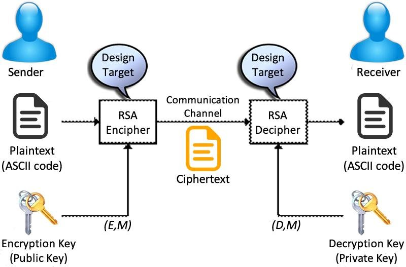

# RSA-Toolkit-Comprehensive-Encryption-and-Decryption-in-C
My C-based RSA encryption and decryption tool is an all-in-one solution, featuring stress-testing and performance analysis tools. Brute-force attacks, including prime factorization, have been thwarted, and secure data encryption and decryption application have been created, employing socket programming for seamless communication with a server.


## How the algorithm works?
  1. Using the published public key (e) of the receiver, the sender decrypt the message (plaintext) to the ciphertext (what will be send): C = E(e, M)

  2. Using the private key (d) of the receiver, the receiver decrypt the message: M = E(d, M)

  3. Each party should publish it public key (e) and (n) which is the product of the 2 very long prime numbers used to generate the keys (p, q)



## RSA Toolkit APIs
  ```C
  void RSA_Key_Generate(RSA_KEY_t *key, int nbits);
  void RSA_free(RSA_KEY_t *key);
  void RSA_Key_print(RSA_KEY_t *key);
  void encrypt(mpz_t m, RSA_KEY_t *key, mpz_t c);
  void decrypt(mpz_t c, RSA_KEY_t *key, mpz_t m);
  int encode(char *plainText, char*** cipherText, int n);
  void decode(char*** cipherText, char** plainText, int n, int nBlocks);

  int Encrypt(char *plainText, RSA_KEY_t *key, char **ciphertext, int blockSize);
  int Decrypt(char *ciphertext, RSA_KEY_t *key, char **plaintext, int blockSize);
  ```

## Requirements
  1. Unix-based operating system or WSL in windows
  2. GCC Compiler
  3. Python 3.x (If you want to run the analysis plotter)

## How to run
  1. Clone the repository by running the following command in terminal:
  ```bash
  git clone https://github.com/AhmedAlaa2024/RSA-Toolkit-Comprehensive-Encryption-and-Decryption-in-C.git
  ```

  2. Navigate to the directory where the repository was cloned:
  ```bash
  cd RSA-Toolkit-Comprehensive-Encryption-and-Decryption-in-C
  ```

  3. Run compile.sh script:
  ```bash
  sudo chmod 777 compile.sh
  ./compile.sh
  ```

  4. If you want to run the Chatting Room, open 2 terminals and run each command in each terminal:
  ```bash
  ./Server
  ./Client
  ```
  Note: Now you can write anything in both Server, Client and enjoy secure chatting.

  5. If you want to run the performance analysis of the encryption and decryption:
  ```bash
  cd PerformanceAnalysis
  ./Encryption_Decryption_Analysis
  ```

  6. If you want to run the timing analysis of the brute force attack using prime factorization:
  ```bash
  cd PerformanceAnalysis
  ./BruteforceAttack_PrimeFactorization_Analysis
  ```

  7. If you want to replot the produced data due to step 5 or 6, open the python note book `analysis.ipynb` and run it.

## RSA Performance Under Stress Test


<br>
<br>


###### This software is licensed under MIT License, See [License](./LICENSE) for more information ©AhmedAlaa.